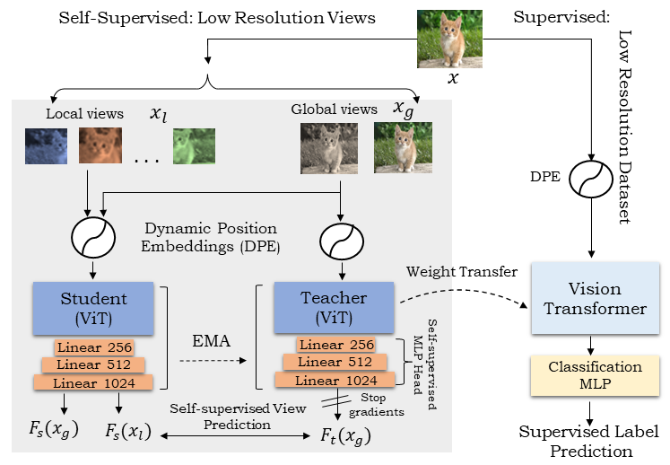
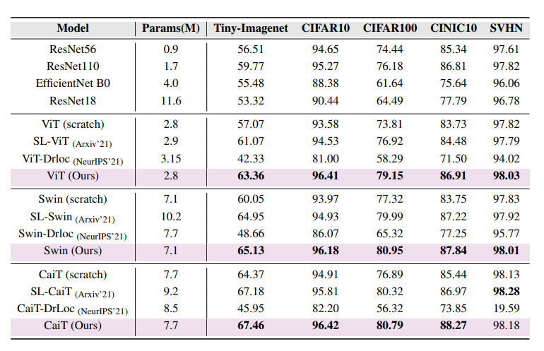
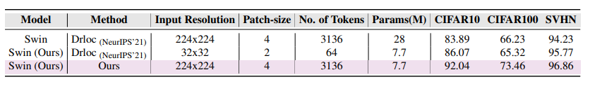
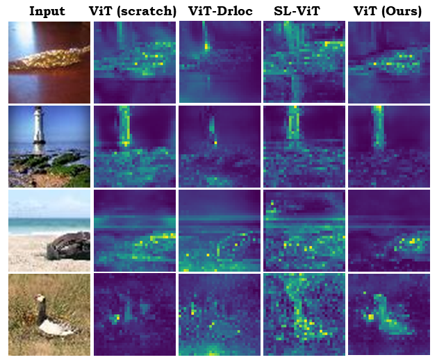
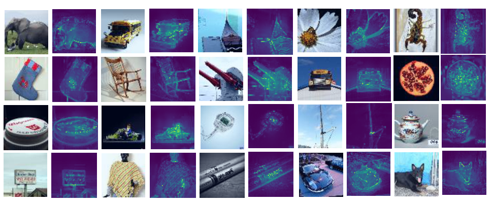

# How to Train Vision Transformer on Small-scale Datasets?

[Hanan Gani](https://scholar.google.co.in/citations?user=XFugeQ4AAAAJ&hl=en), [Muzammal Naseer](https://muzammal-naseer.netlify.app/), and [Mohammad Yaqub](https://scholar.google.co.uk/citations?hl=en&user=9dfn5GkAAAAJ&view_op=list_works&sortby=pubdate)

#


> **Abstract:** *Vision Transformer (ViT), a radically different architecture than convolutional neural networks offers multiple advantages including design simplicity, robustness and state-of-the-art performance on many vision tasks. However, in contrast to convolutional neural networks, Vision Transformer lacks inherent inductive biases. Therefore, successful training of such models is mainly attributed to pre-training on large-scale datasets such as ImageNet with 1.2M or JFT with 300M images. This hinders the direct adaption of Vision Transformer for small-scale datasets. In this work, we show that self-supervised inductive biases can be learned directly from small-scale datasets and serve as an effective weight initialization scheme for fine tuning. This allows to train these models without large scale pre-training, changes to model architecture or loss functions. We present thorough experiments to successfully train monolithic and non-monolithic Vision Transformers on five small datasets including CIFAR10/100, CINIC-10, SVHN, and Tiny-ImageNet. Our approach consistently improves the performance while retaining their properties such as attention to salient regions and higher robustness.*
>


#
<hr>

## Contents

1. [What's New?](#What's-New?)
2. [Highlights](#Highlights)
3. [Requirements](#Requirements)
4. [Self-Supervised Pretraining](#Run-self-supervised-pretraining-with-ViT-architecture)
5. [Supervised Training](#Finetune-the-self-supervised-pretrained-checkpoint-on-the-given-dataset)
6. [Results](#Results)
7. [Citation](#Citation)
8. [Contact](#Contact)
9. [References](#References)


<hr>

## What's New?
#
### (August 08, 2022)
    * Self-supervised training and finetuning code released.
   
<hr>

## Highlights
1. Vision Transformers, whether monolithic or non-monolithic, both suffer when trained from scratch on small datasets. This is primarily due to the lack of locality, inductive biases and hierarchical structure of the representations which is commonly observed in the Convolutional Neural Networks. As a result, ViTs require large-scale pre-training to learn such properties from the data for better transfer learning to downstream tasks. We show that inductive biases can be learned directly from the small dataset through self-supervision, thus serving as an effective weight initialization for finetuning on the same dataset.


<!--  -->
<!--  -->


2. Our proposed self-supervised inductive biases improve the performance of ViTs on small datasets without modifying the network architecture or loss functions.

<hr>

## Requirements
```shell
pip install -r requirements.txt
```

<hr>

## Self-supervised Training 

#### For Tiny-Imagenet:
With ViT architecture

```shell
python -m torch.distributed.launch --nproc_per_node=2 train_ssl.py --arch vit \
                                   --dataset Tiny_Imagenet --image_size 64 \
                                   --datapath "/path/to/tiny-imagenet/train/folder" \
                                   --patch_size 8  \
                                   --mlp_head_in 192 \
                                   --local_crops_number 8 \
                                   --local_crops_scale 0.2 0.4 \
                                   --global_crops_scale 0.5 1. 
                                   --out_dim 1024 \
                                   --batch_size_per_gpu 256  \
                                   --output_dir "/path/for/saving/checkpoints"
```
With Swin architecture

```shell
python -m torch.distributed.launch --nproc_per_node=2 train_ssl.py --arch swin \
                                   --dataset Tiny_Imagenet --image_size 64 \
                                   --datapath "/path/to/tiny-imagenet/train/folder" \
                                   --patch_size 4  \
                                   --mlp_head_in 384 \
                                   --local_crops_number 8 \
                                   --local_crops_scale 0.2 0.4 \
                                   --global_crops_scale 0.5 1. 
                                   --out_dim 1024 \
                                   --batch_size_per_gpu 256  \
                                   --output_dir "/path/for/saving/checkpoints"
```

#


#### For CIFAR based datasets:

With ViT architecture
```shell
python -m torch.distributed.launch --nproc_per_node=2 train_ssl.py --arch vit \
                                   --dataset CIFAR10 --image_size 32 \
                                   --patch_size 4  \
                                   --mlp_head_in 192  \
                                   --local_crops_number 8 \
                                   --local_crops_scale 0.2 0.5 \
                                   --global_crops_scale 0.7 1. 
                                   --out_dim 1024 \
                                   --batch_size_per_gpu 256  \
                                   --output_dir "/path/for/saving/checkpoints"
```

With Swin architecture

```shell
python -m torch.distributed.launch --nproc_per_node=2 train_ssl.py --arch swin \
                                   --dataset Tiny_Imagenet --image_size 32 \
                                   --datapath "/path/to/tiny-imagenet/train/folder" \
                                   --patch_size 2  \
                                   --mlp_head_in 384  \
                                   --local_crops_number 8 \
                                   --local_crops_scale 0.2 0.5 \
                                   --global_crops_scale 0.7 1. 
                                   --out_dim 1024 \
                                   --batch_size_per_gpu 256  \
                                   --output_dir "/path/for/saving/checkpoints"
```

``` --dataset ``` can be ``` Tiny_Imagenet/CIFAR10/CIFAR100/CINIC/SVHN ```.

``` --arch ``` can be ``` vit/swin/cait ```.

``` --local_crops_scale ``` and ``` --global_crops_scale ``` vary based on the dataset used.

``` --mlp_head_in ``` is dimension of the Vision transformer output going into Projection MLP head and varies based on the model used.


<hr>

## Supervised Training
```shell
python finetune.py --arch vit  \
                   --dataset Tiny-Imagenet \
                   --datapath "/path/to/data/folder" \
                   --batch_size 256 \
                   --epochs 100 \
                   --pretrained_weights "/path/to/saved/checkpoint"
``` 
``` --arch ``` can be ```vit/swin/cait ```.
``` --datasets ``` can be ```Tiny-Imagenet/CIFAR10/CIFAR100/CINIC/SVHN ```.
Load the corresponding weights for finetuning.

<hr>

## Results
We test our approach on 5 small low resolution datasets: Tiny-Imagenet, CIFAR10, CIFAR100, CINIC10 and SVHN. We compare the results of our approach with 4 baselines: ConvNets, Scratch ViT training, [Efficient Training of Visual Transformers with Small Datasets (NIPS'21)](https://openreview.net/forum?id=SCN8UaetXx), [Vision Transformer for Small-Size Datasets (arXiv'21)](https://arxiv.org/abs/2112.13492)
#### 1. Quantitative results :


#

#### 2. Results on high resolution inputs as compared to baseline - [Efficient Training of Visual Transformers with Small Datasets (NIPS'21)](https://openreview.net/forum?id=SCN8UaetXx)


#

####  3. Qualitative results - Attention to salient regions
Our proposed self-supervised training is able to capture
the shape of the salient objects efficiently with minimal or no attention to the background on unseen test-set.
samples without any supervision.

<!--  -->



<hr>

## Citation

<hr>

## Contact
Should you have any questions, please create an issue in this repository or contact at hanan.ghani@mbzuai.ac.ae
<hr>

## References
Our code is build on the repositories of [DINO](https://github.com/facebookresearch/dino) and [Vision Transformer for Small-Size Datasets](https://github.com/aanna0701/SPT_LSA_ViT). We thank them for releasing their code.

<hr>

  
